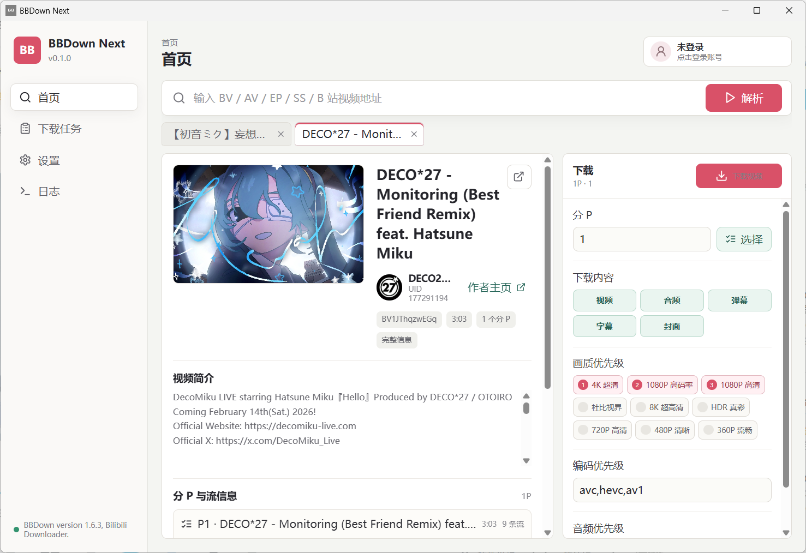
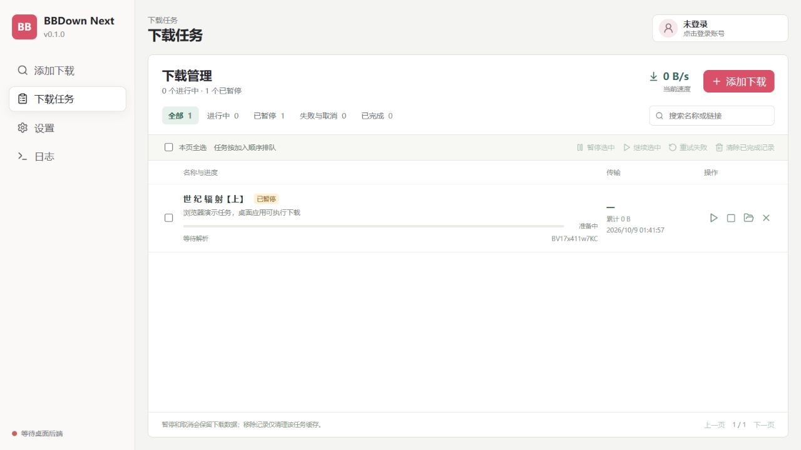

# BBDown Next

BBDown Next 是一个面向 Windows 的 B 站下载器，使用 Tauri 2、React、TypeScript 和 Rust 构建。视频解析、扫码登录、流选择和下载已内置到 Rust 后端，媒体合并由 FFmpeg 执行。

> 运行时唯一需要的外部媒体工具是 FFmpeg；不需要 BBDown.exe、.NET、aria2c 或 MP4Box。

## 功能

- BV / AV、普通视频、多 P、EP / SS 番剧、课程、b23.tv 短链接及国际版番剧链接解析。
- 收藏夹、个人空间投稿、合集和系列的分页解析与批量选集，展开视频中的多 P。
- 多解析页签，保留已解析的视频信息。
- 展示封面、作者、简介、分 P、CID 和音视频流。
- WEB / TV 扫码登录、Cookie 和 Access Token 配置；退出时删除本机凭据。
- 画质、编码、音频优先级和下载内容配置。
- 持久化下载队列，任务并发限制，暂停 / 继续 / 取消 / 重试及批量操作。
- 当前文件百分比、数据大小、速度和预计剩余时间，任务文件清单与目录定位。
- 多连接 Range 分段下载；服务器不支持 Range 时回退到单连接；失败重试和备用地址切换。
- WEB / APP 字幕获取和回退、INTL JSON / ASS / SRT 字幕、弹幕 XML、封面；FFmpeg 合并音视频、字幕和章节。
- 可选的文件名模板和下载记录。同名输出自动编号，保留已有文件。

## 下载管理

下载立即进入后台队列，解析页可以继续使用。在“下载任务”页筛选进行中、已暂停、失败与取消、已完成任务，支持多选暂停、继续、重试失败和清除记录。

- 默认同时运行 2 个任务，每个媒体文件最多 4 个连接；设置范围分别为 1–8 和 1–16。并发上限控制后续启动，不中断已经运行的任务；连接数用于新建任务。
- 默认启动后将上次未完成的任务恢复为暂停，点击继续后刷新媒体地址；可选择自动继续。主动暂停和已取消任务不会被自动启动。
- 分片与已完成的分 P 会保留。支持 Range 且提供可用 ETag / Last-Modified 的服务器可以从已保存的分片继续；验证信息变化时重新下载该文件。缺少安全校验信息或不支持 Range 时使用完整下载，该文件的暂停续传会从头开始。
- 下载计划保存选中的 AID / CID / 剧集 ID，列表顺序变化不会把恢复任务指向新插入的视频。
- 进度条和剩余时间表示当前媒体文件，已完成分 P 单独显示。合并时不显示虚构的网络下载速度。
- 任务保留下载选项；恢复时使用当前保存的登录凭据，不把 Cookie、Token 或媒体签名地址写入任务记录。
- 取消保留下载数据以便重试。移除记录清理该任务缓存，保留已保存的完整文件。已完成任务会自动清理缓存。

任务记录为 `%APPDATA%\com.bbdown.next\tasks.json`。每个任务的缓存位于该任务下载目录的 `.bbdown-next-cache/<任务ID>/`，暂停后不要手动删除缓存。

运行日志保存在 `%APPDATA%\com.bbdown.next\logs\application.jsonl`，重启后可在“日志”页查看最近 1000 条记录。后台下载失败会记录任务、分 P 和错误原因；日志隐藏 Cookie、Token 和链接查询参数。每个日志文件最多 4 MiB，并保留上一份轮换日志。

## 内置核心支持范围

核心包含 WEB、TV、APP、INTL 四种播放接口，仍只调用 FFmpeg 处理媒体。开发和运行均不需要 .NET 或额外的 Protobuf 编译器。

APP 请求自动协商 HTTP 版本，兼容仅支持 HTTP/1.1 的字幕网关。WEB 明确返回空字幕列表且不要求登录时，直接跳过字幕；接口失败或需要登录才能查看时，仍尝试其他字幕接口。

| 接口 | 内容 | 凭据 |
| --- | --- | --- |
| WEB | 普通视频、多 P、番剧、课程 | WEB 扫码 / 浏览器 Cookie |
| TV | 普通视频、多 P、番剧 | TV 扫码 / 对应 Token |
| APP | 普通视频、多 P、番剧，使用 Protobuf/gRPC | TV/APP Token；公开内容可尝试匿名播放 |
| INTL | 国际版番剧 EP / SS、bilibili.tv 链接 | 国际版凭据；不自动复用国内 TV Token |

在“设置 → 播放接口”切换模式。账号页提供 WEB 扫码、TV/APP 扫码、Cookie 和 Token 四种入口。APP 普通视频查询 AVC / HEVC / AV1；APP 番剧使用上游接口提供的 HEVC。Token 配置状态与 WEB 账号验证状态分别显示；配置 Token 后由播放接口验证其权限。

EP 链接解析指定剧集，SS 链接解析整季并支持选集。会员、付费和地区受限内容需有对应观看权限。INTL 在当前测试网络返回“版权地区受限”，已验证真实元数据和权限错误处理，未完成有权限账号下的实际媒体下载。

列表元数据使用国内 WEB 接口。私密收藏夹以及需要校验的空间请求应先完成 WEB 登录，必要时在浏览器完成校验后导入 Cookie。当前匿名空间请求可能返回 HTTP 412 / -352；应用会显示验证提示。合集已验证真实跨页展开；收藏夹、空间、系列的分页和多 P 展开有本地接口模拟测试。失效条目会跳过并显示原因，重复页或停滞游标会停止并报错。

列表中的序号是展开后的全局序号，选集支持 `ALL`、`1,3`、`2-5`、`LAST` / `LATEST`。下载保留每个源视频的封面、作者和简介；下载记录使用 AID / CID，列表插入新条目或选集变化不会改变已下载视频的记录身份。

可用输入示例：

```text
fav:收藏夹ID
space:用户UID
list:合集ID
series:系列ID
https://space.bilibili.com/用户UID/favlist?fid=收藏夹ID
https://space.bilibili.com/用户UID/lists/合集ID?type=season
https://space.bilibili.com/用户UID/lists/系列ID?type=series
https://www.bilibili.tv/en/play/季ID/剧集ID
```

空间 `/favlist` 链接不指定 fid 时读取返回的收藏夹。弹幕 XML 保存接口当前返回的范围。Cookie 自动刷新、历史弹幕和 APP 番剧的角色配音混合尚未实现；TV 刷新凭据已保存，但暂不自动刷新 Token。

## 页面展示





## 运行要求

- Windows 10/11。
- Microsoft Edge WebView2 Runtime。
- FFmpeg。

源码仓库和安装包不包含 FFmpeg。启动应用后可在“设置”中配置 `ffmpeg.exe` 路径，或者将 FFmpeg 加入 PATH（路径填 `ffmpeg`）。解析和登录不需要 FFmpeg；不开启合并时可直接下载 DASH 原始流。

完整文件先写入任务缓存，再通过 Windows 原生文件移动提交，不覆盖已有目标。暂停或取消会中断网络操作和 FFmpeg，保留可恢复数据；继续同一任务沿用已分配的文件名，新任务的同名输出自动编号。

## 开发

需要 Node.js 22、npm 和 Rust stable。克隆仓库后执行：

```powershell
npm ci
npm run build
cargo test --manifest-path src-tauri/Cargo.toml
npm run tauri dev
```

只预览前端：

```powershell
npm run dev
```

前端预览使用演示数据，不连接 Rust 下载核心或真实登录流程。

## 构建

生成 Windows 应用和安装包：

```powershell
npm run tauri build
```

构建产物位于 `src-tauri/target/release/`

## 目录说明

- `src/`：React 界面、类型和后端调用。
- `src-tauri/src/`：Rust 内置核心、队列、账号与日志管理。
- `src-tauri/tests/fixtures/`：固定的脱敏接口测试数据。
- `src-tauri/capabilities/`、`icons/`：桌面权限与应用图标。
- `docs/images/`：项目说明中的界面图片。
- `.github/`：持续集成和 PR 模板。

本机可运行程序单独放在 `release/bbdown-next.exe`，并附带许可说明；`release/` 不提交到源码仓库。`node_modules/`、`dist/`、`src-tauri/target*/`、`src-tauri/gen/` 都是可重新生成的依赖或构建目录，不纳入版本管理。

## 数据目录

- 应用配置：`%APPDATA%\com.bbdown.next\config.json`
- 默认下载目录：`%USERPROFILE%\Downloads\BBDown Next`
- 下载队列与历史：`%APPDATA%\com.bbdown.next\tasks.json`
- 运行日志：`%APPDATA%\com.bbdown.next\logs\application.jsonl`
- 内置扫码凭据：`%APPDATA%\com.bbdown.next\account.json`
- 登录二维码：应用配置目录中的临时 `login-<task-id>.svg`，登录结束或取消后删除

退出登录会清空应用配置中的 Cookie/token，取消 WEB / TV 扫码任务，并删除 `account.json` 中的 WEB Cookie、TV/APP Token 及刷新凭据。TV 凭据过期会提示重新登录。

首次升级时保留下载和画质设置，移除旧的 BBDown、aria2c、MP4Box 配置。旧配置指定的 BBDown 目录中若存在 `BBDown.data`，会导入其 WEB 登录凭据，并导入 `BBDownTV.data` 中的 TV Token；原目录中的第三方凭据文件不会删除。

## 核心结构与验证

`src-tauri/src/bilibili/` 中的 `client`、`wbi`、`tv`、`app`、`intl`、`lists`、`streams`、`subtitles`、`transfer`、`resume`、`session`、`download`、`login` 模块负责接口、签名、各端协议、列表、流选择、字幕、下载、输出和登录。下载时重新获取媒体 URL；解析结果的短期内存缓存不用于下载。前端通过 Tauri 命令和任务事件调用内置核心。`task.rs` 管理队列状态、并发和持久化；`downloads.rs` 调度后台任务。

`cargo test` 默认运行确定性的协议、文件和本地 HTTP 模拟测试。真实 FFmpeg 合并及 B 站网络测试显式运行：

```powershell
cargo test --manifest-path src-tauri/Cargo.toml ffmpeg_muxes_downloaded_streams_and_subtitles -- --ignored
cargo test --manifest-path src-tauri/Cargo.toml live_web_parse_smoke -- --ignored
cargo test --manifest-path src-tauri/Cargo.toml live_download_smoke -- --ignored
cargo test --manifest-path src-tauri/Cargo.toml live_tv_and_app_playback -- --ignored
cargo test --manifest-path src-tauri/Cargo.toml live_tv_qr_generation_and_pending_poll -- --ignored
cargo test --manifest-path src-tauri/Cargo.toml live_app_subtitle_gateway_negotiates_supported_http_version -- --ignored
cargo test --manifest-path src-tauri/Cargo.toml live_collection_resolves_all_entries -- --ignored
cargo test --manifest-path src-tauri/Cargo.toml live_space_metadata_or_validation_response -- --ignored
cargo test --manifest-path src-tauri/Cargo.toml live_intl_metadata_and_permission_response -- --ignored
```

网络测试默认不读取本地账号，临时下载文件在测试结束后清理。空间校验与 INTL 权限测试明确接受服务返回的风控或地区限制，不代表受限媒体下载通过。扫码手机确认、会员流、私密列表和付费课程需要对应账号人工验证。

## MIT许可

[MIT License](LICENSE)。BBDown 协议移植的上游归属见 [第三方声明](THIRD_PARTY_NOTICES.md)。
